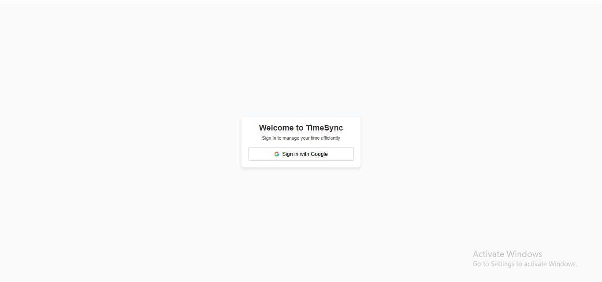

# TimeSync-Lite 🎯

## Basic Details
### Team Name: SyncOn

### Team Members
- Member 1: Varsha Thomas - Govt. Model Engineering College
- Member 2: Sthuthi Sambath - Govt. Model Engineering College

### Hosted Project Link
[Project URL](https://timesync-lite-frontend1.onrender.com/)

### Project Description
Our project focuses on creating a web application that enables users to generate daily schedules based on task priority and duration. The tool allows users to input tasks, set their priorities, specify durations, and define their available time slots. Based on this information, the application generates a clear and structured timetable that allocates tasks optimally.

### The Problem statement
Managing daily tasks efficiently is a common challenge, especially when there are multiple tasks with varying priorities and durations. Most existing tools lack an intuitive way to allocate time effectively based on task priority and duration within a given schedule. This often leads to poorly structured plans, inefficient time usage, and difficulty in maintaining consistency.

There is a need for a scheduling tool that helps users create a structured timetable by prioritizing tasks and considering their durations. This tool should automate the allocation of time slots for tasks while allowing users to define preferences, such as break times, to ensure a practical and manageable schedule.

### The Solution
Our solution is a web-based scheduling tool that simplifies the process of creating structured daily timetables. By considering task priority, duration, and available time slots, the tool ensures efficient time allocation for all tasks while allowing flexibility for breaks.

Key features of the solution include:

**Task Management**: Users can input tasks with their respective durations and assign priorities (High, Medium, Low).
**Break Customization**: Users can set preferred intervals and durations for breaks, ensuring a balanced schedule.
**Automated Scheduling**: The tool dynamically generates a timetable by prioritizing tasks and fitting them into the available time slots based on user input.
**Visual Schedule Representation**: The generated timetable is displayed in a clean and easy-to-read tabular format.
This solution directly addresses the challenge of poor time management by providing a systematic approach to planning daily tasks. It helps users focus on high-priority tasks while accommodating all activities within their available time frame.

## Technical Details
### Technologies/Components Used
For Software:
- Languages used: Javascript , Python
- Frameworks used: ReactJS , Flask
- Database used: MongoDB

### Implementation
The **TimeSync Lite** project consists of a **React.js frontend** and a **Flask backend** that interact with **MongoDB Atlas** to store and manage scheduling data.

   ### **Backend (Flask API)**
   - **Handles task scheduling** based on priority and duration.
   - **Stores timetables** in MongoDB for historical reference.
   - **Provides API endpoints** for generating schedules and fetching history.

   **Key Files:**
   - `backend/app.py` → Core API logic.
   - `backend/requirements.txt` → Python dependencies.

   ### **Frontend (React.js)**
   - **Allows users to input tasks, set preferences, and view timetables.**
   - **Fetches data** from the backend via API calls.
   - **Displays task history** with filtering options.

   **Key Files:**
   - `frontend/src/components/Dashboard.js` → Task input & scheduling.
   - `frontend/src/components/HistoryPage.js` → History retrieval.
   - `frontend/src/App.js` → Main React entry point.

  ### **Database (MongoDB)**
   - Stores **tasks**, **timetables**, and **user preferences**.
   - Data is **retrieved in the History Page** for past schedules.

   **MongoDB Schema Example:**
   json
   {
     "tasks": [
       {"name": "Project Work", "priority": "High", "duration": "1h 30m"}
     ],
     "available_time": ["09:00", "17:00"],
     "timetable": [
       {"time": "09:00 - 10:30", "task": "Project Work", "priority": "High"}
     ]
   }
   
 ### **Future Enhancements**
   - ✅ **User Authentication** – Store personal schedules for different users.
   - ✅ **Reminder Notifications** – Notify users before upcoming tasks.
   - ✅ **AI-based Smart Scheduling** – Optimize timetable based on habits.

# Installation
*Prerequisites*  
Make sure you have the following installed:  
- *Python 3.8+* – [Download Here](https://www.python.org/downloads/)  
- *Node.js 14+* – [Download Here](https://nodejs.org/)  
- *MongoDB Atlas* (or Local MongoDB) – [Setup Guide](https://www.mongodb.com/)  
- *Git* – [Download Here](https://git-scm.com/)  

#### *Clone the Repository*  
bash
git clone https://github.com/tinkerhub/tink-her-hack-3-temp.git
cd tink-her-hack-3-temp

#### *Backend Setup (Flask API)*  
Navigate to the backend folder and install dependencies:  
bash
cd backend
pip install -r requirements.txt

**Set up .env file** inside backend/ with MongoDB URI:  

MONGO_URI="your_mongodb_connection_string"

Run the Flask server:  
bash
python app.py

The API should now be running on http://127.0.0.1:5001/ 🚀  

#### *Frontend Setup (React.js)*  
Navigate to the frontend folder and install dependencies:  
bash
cd frontend
npm install

Run the React app:  
bash
npm start

The UI should now be running at http://localhost:3000/ 🎨  

#### *MongoDB Setup*  
- If using *MongoDB Atlas*, create a free cluster, and replace "your_mongodb_connection_string" in .env.  
- If using *Local MongoDB*, ensure it's running:  
bash\
mongod --dbpath <your_db_path>

# Run
**Run the Backend:**
   bash \
   cd backend \
   pip install -r requirements.txt \
   python app.py

**Run the Frontend:**
   bash \
   cd frontend \
   npm install \
   npm start 

### Project Documentation
For Software:

# Screenshots

*Login Page*

*Dashboard - Before clicking "Generate Timetable"*

*Dashboard - Before clicking "Generate Timetable"*

*History - 8th Feb*

*History - 9th Feb*

# Build Photos

### Project Demo
# Video
[Demo Video](https://drive.google.com/file/d/1lcvq5DdeJpUGJvboYEQOK95Uk8zzIyGe/view?usp=drive_link)

Firstly, we see the login page, where the user can log in using their Google account.
Then, the user is directed to the dashboard where they can add their tasks as per priority and expected duration of completion. 
Clicking the generate timetable button creates the schedule for the user as per given parameters. 

Secondly, we see the history page, where the user can obtain the past and present schedules as per given date. They can clear the history as well if they wish to.

## Team Contributions
- Sthuthi Sambath: Front-end, Deployment
- Varsha Thomas: Back-end

---
Made with ❤️ at TinkerHub
